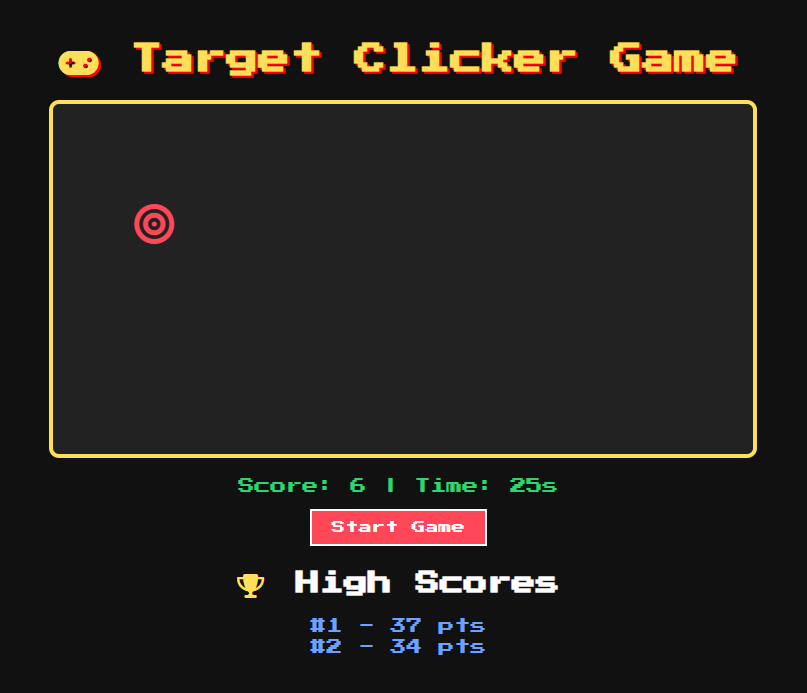
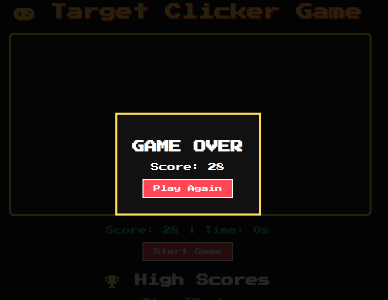

# About

- This is a Retro Arcade Style clicking game built using HTML, CSS, and JavaScript.

- this project combines gameplay logic, animations, and persistent high scores stored through LocalStorage to create a simple and fun browser game.

# Features

- Clickable moving target with random positioning
- 30-second countdown timer
- Real-time score tracking
- High score leaderboard (Top 5)
- Persistent data using localStorage
- Retro 8-bit inspired UI and animations
- Replay functionality with custom modal
- Responsive and centered layout

# Game Screen

# Game Over Screen

# Tech Stack
- HTML5 – Structure
- CSS3 – Styling, animations, responsiveness
- JavaScript (Vanilla) – Game logic and interactivity
- FontAwesome – Icons
- LocalStorage API – Saving high scores

# Getting Started
- Clone the Repository
git clone https://github.com/desireedagondon000-gif/click_game.git
- Navigate to the Project Folder
cd click_game
- Open the Project

# Option A: Open in Browser

- Open index.html in any browser like Chrome or Edge

# Option B: Use Live Server (Recommended)

- Open the folder in VS Code
Right-click index.html and then Open with Live Server

